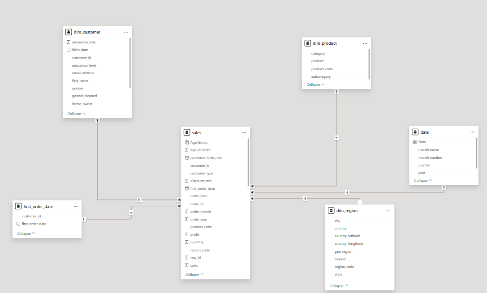
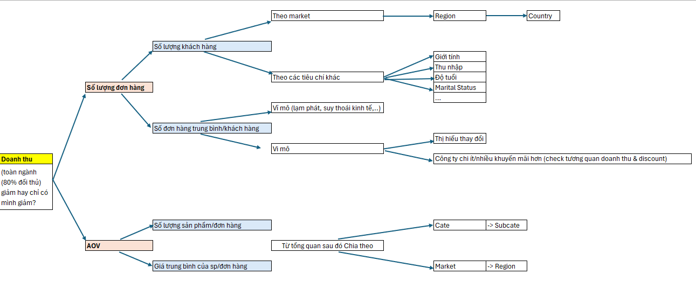
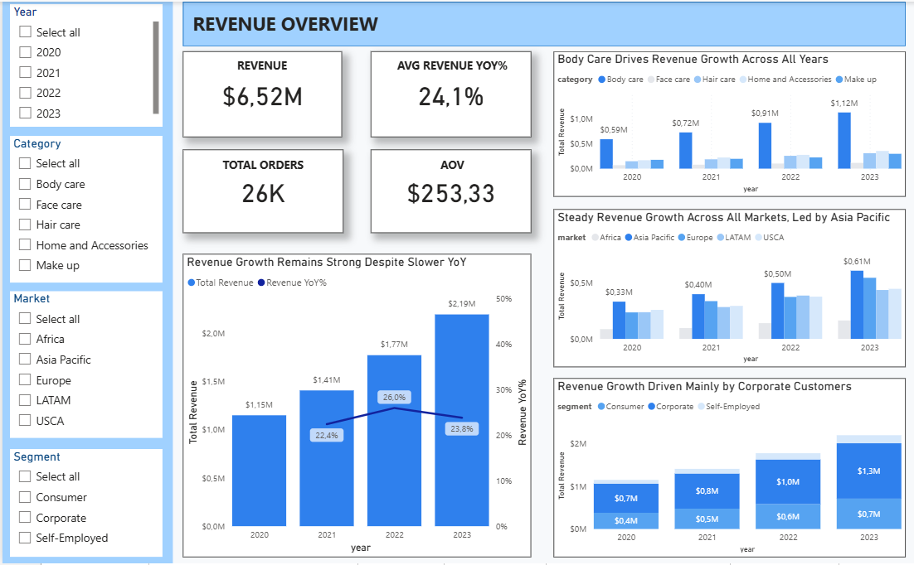
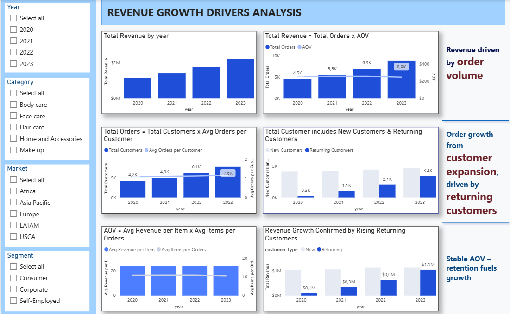
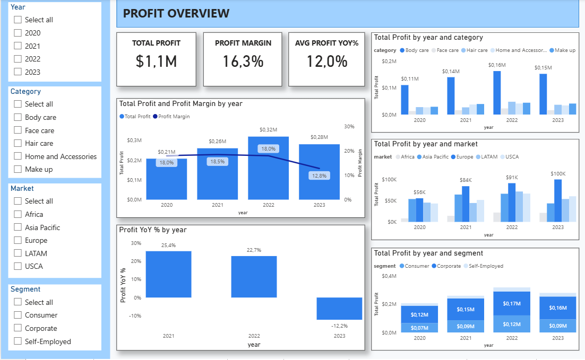
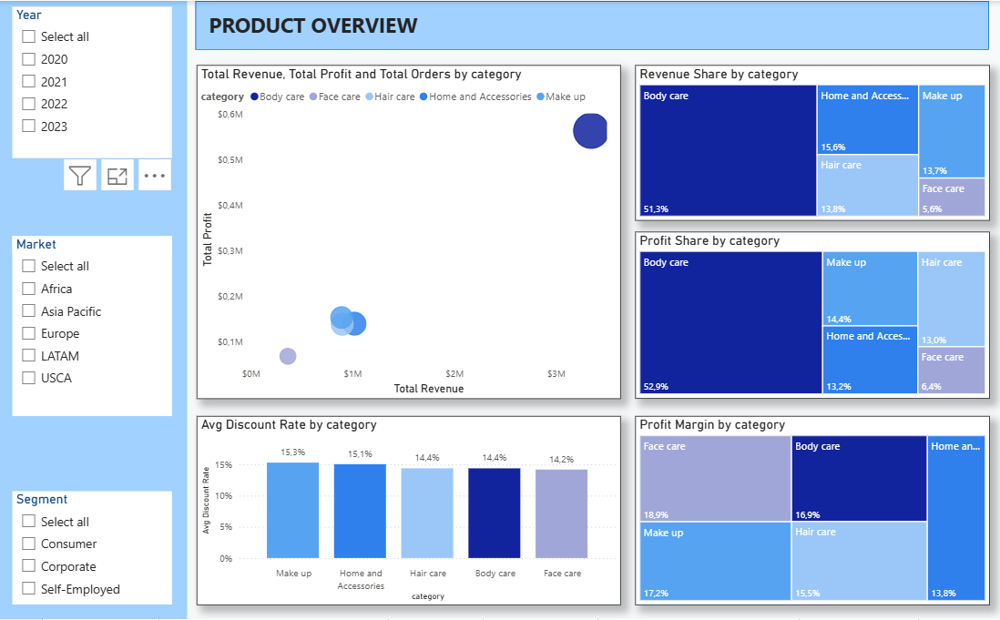
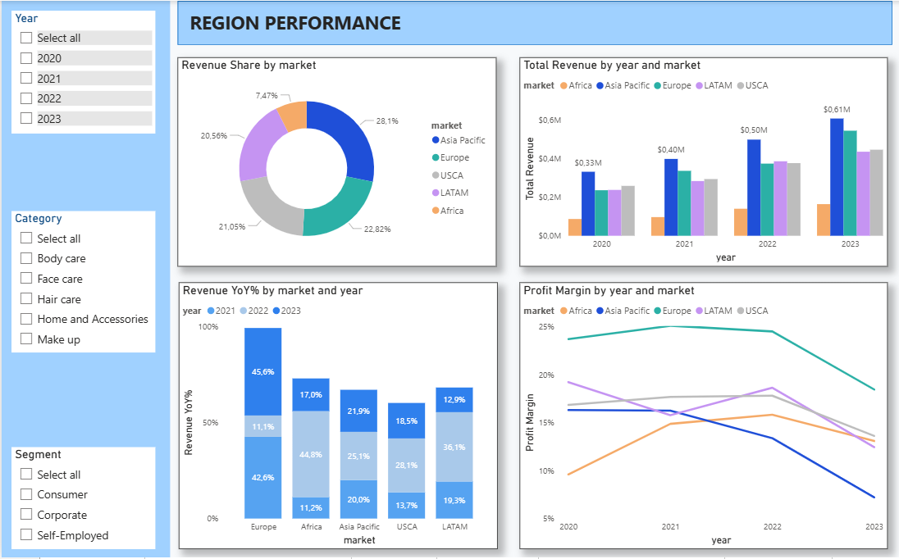
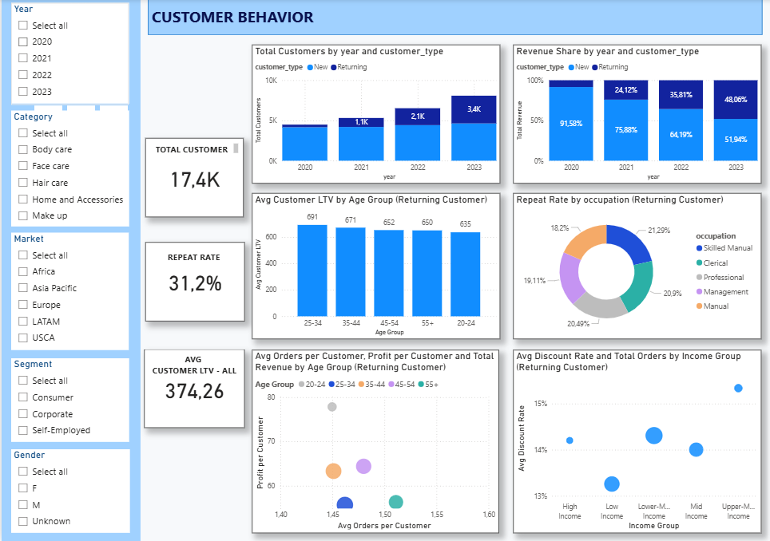

# Ecommerce Data Analysis & Visualization (Power BI)

## Business Context
XOMDATA is a global e-commerce company operating in the Personal Care industry, offering multiple product categories across international markets.  
To support data-driven decision-making, the leadership team needs a clear, structured reporting system to:

- Track business performance over time  
- Understand growth drivers  
- Identify risks in profitability  
- Analyze customer behavior  

You are assigned as a Data Analyst to design an end-to-end Power BI dashboard that transforms raw transactional data into strategic insights.

---

## Business Questions

This project is built around the following core questions:

1. How is the business growing, and is that growth sustainable?
2. What truly drives revenue growth: volume, pricing, or customer behavior?
3. Where are profit and margin under pressure—and why?
4. Which product categories and regions act as growth engines?
5. Who are the customers behind growth, and how do they behave?
6. Is growth being “bought” through discounts or driven by real demand?

---

## Data Model

- **Fact Table:** Sales  
- **Dimension Tables:** Customer, Product, Region, Date  



The model follows a star schema to ensure performance, flexibility and analytical clarity.

---

## Analysis Framework & Thought Process

This project follows a **hypothesis-driven, MECE-based** approach:

1. Translate business questions into **issue trees**  
   - Example:  
     ```
     Revenue
     ├── Orders
     │   ├── Customers
     │   │   ├── New
     │   │   └── Returning
     │   └── Orders per Customer
     └── AOV
         ├── Items per Order
         └── Revenue per Item
     

2. Identify required data to answer each branch

3. Data Exploration & Cleaning  
   - Identify data quality issues  
   - Classify as *Solvable* vs *Unsolvable*  
   - Fix solvable issues  
   - Evaluate impact of unsolvable ones  
   - Enrich dataset when raw data is insufficient

   Examples of enrichment:
   - Classify customers into **New vs Returning**  
   - Derive **Age** and group into business-relevant Age Bands  
   - Group Annual Income into meaningful Income Segments  


4. Build DAX measures aligned with the issue tree  
   - Measures are organized into folders:
     - `01. Revenue`
     - `02. Orders & Volume`
     - `03. Discount`
     - `04. Profit`
     - `05. Customer`

5. Iterate with:
   - Draft visuals  
   - Hypothesis testing  
   - Pattern validation  
   - Business interpretation  

6. Design dashboards to tell a **coherent business story**

---

## Technical Highlights

- Advanced DAX:
  - Weighted averages (e.g., Discount Rate = Discount Amount / Revenue)
  - Customer LTV via `AVERAGEX(VALUES(Customer), [Customer LTV])`
  - Context-aware metrics across Category × Market × Segment
- Measure architecture using logical folders for scalability
- Star-schema data modeling
- Business-oriented metric design (Retention, LTV, Mix, Margin)

---

## Dashboard Structure & Key Insights


Each sheet answers a distinct strategic question.

---

### 01. Revenue Overview

**Purpose:** Understand growth trajectory and structural dependencies.

**Key Insights:**
1. Revenue grows consistently (Avg YoY ~24%) → business enters a mature growth phase.  
   *So what:* Shift focus from “can we grow?” to “where does sustainable growth come from?”

2. Growth is concentrated in Body Care, Asia Pacific, and Corporate.  
   *So what:* High efficiency but rising concentration risk.

3. Growth is driven by value, especially in Corporate.  
   *So what:* Corporate acts as a profit engine.

---

### 02. Revenue Growth Drivers

**Purpose:** Decompose revenue into its true drivers.

**Key Insights:**
1. Growth is driven by Orders, not AOV.  
   *So what:* Scale comes from customer base expansion.

2. Customer growth is driven by Returning Customers.  
   *So what:* Shift from acquisition-led to retention-led growth.

3. AOV remains stable.  
   *So what:* Growth is not driven by pricing pressure.

---

### 03. Profit

**Purpose:** Evaluate the quality of growth.

**Key Insights:**
1. Profit declines in 2023 while revenue grows.  
   *So what:* Margin erosion risk.

2. Decline is systemic.  
   *So what:* Structural issue, not a local anomaly.

3. Growth engine and profit engine diverge.  
   *So what:* Scaling without margin discipline is unsustainable.

---

### 04. Product

**Purpose:** Understand product portfolio dynamics.

**Key Insights:**
1. Body Care dominates via scale, not margin.  
   *So what:* Concentration risk.

2. Uniform discount across categories.  
   *So what:* Missed opportunity for portfolio-driven promotion.

3. Category structure is frozen.  
   *So what:* Portfolio lacks strategic rebalancing.

---

### 05. Region Performance

**Purpose:** Identify where sustainable growth comes from.

**Key Insights:**
1. Europe is the highest-quality growth market.  
2. Asia Pacific enters maturity.  
3. Other regions diverge in trajectory.

*So what:* Regional strategies must differ.

---

### 06. Discount

**Purpose:** Assess whether growth is “bought” or organic.

**Key Insights:**
1. Discount rate is stable while revenue grows.  
   *So what:* Growth is organic.

2. Discount concentrates in existing engines.  
   *So what:* Risk of over-subsidizing mature areas.

3. Europe grows with low discount.  
   *So what:* Benchmark for sustainable growth.

---

### 07. Customer Behavior

**Purpose:** Understand who drives growth and how.

**Key Insights:**
1. Growth is driven by Returning Customers.  
2. They are stable-value, mainstream buyers.  
3. They are not discount-driven.

*So what:* Retention is the core growth engine, powered by value—not promotions.

---

## Tools Used

- Power BI  
  - Data Modeling  
  - DAX  
  - Visualization  
  - Dashboard Design  

---

## Output

- End-to-end interactive Power BI dashboard  
- Business-oriented analytical framework  
- Strategic insights across Revenue, Profit, Product, Region, Discount and Customer Behavior  
- A reusable analytical structure for future growth diagnostics
